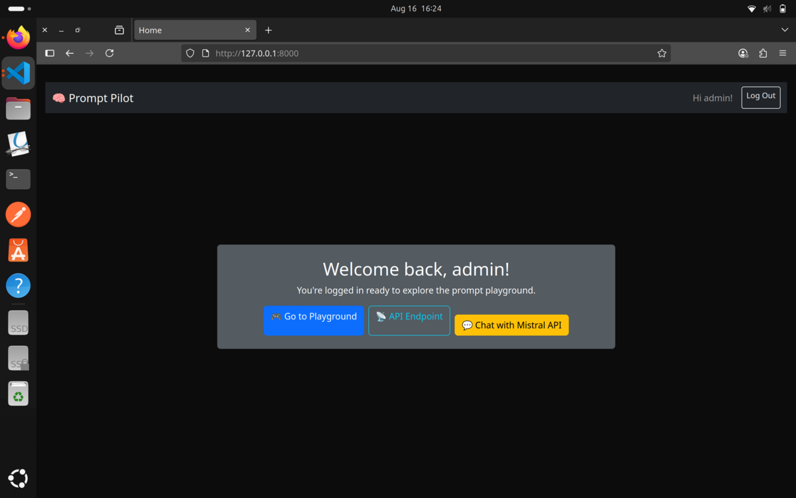
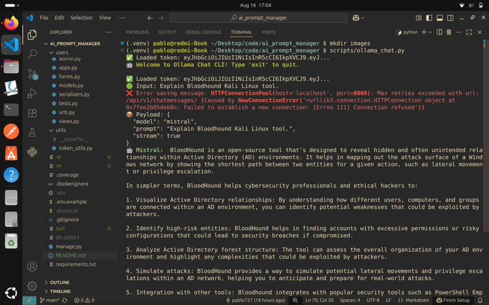
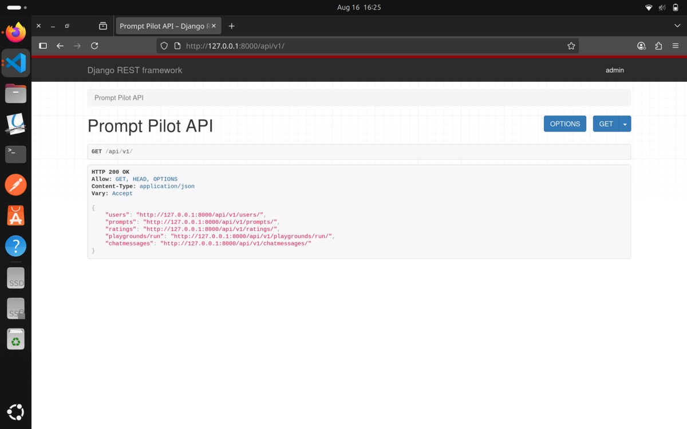
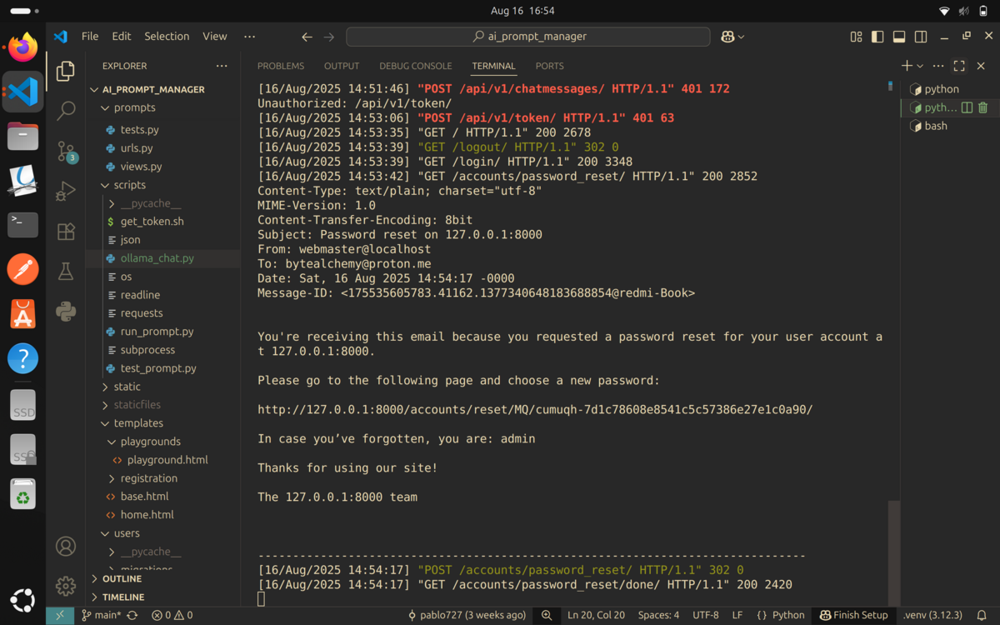
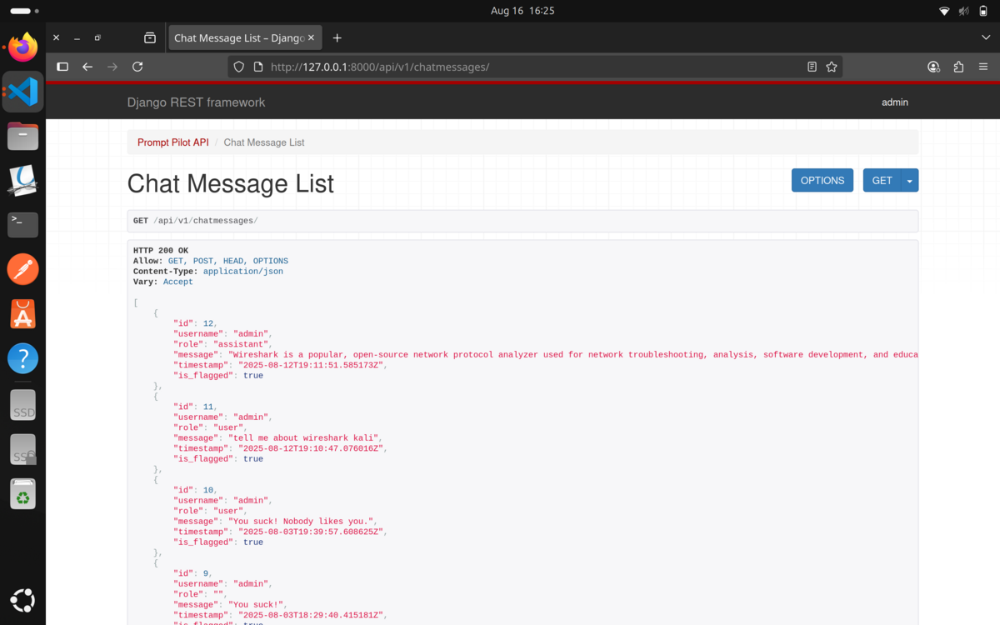

# **PromptPilot** 🚀

[](https://www.python.org/)
[](https://www.djangoproject.com/)
[](https://www.django-rest-framework.org/)
[](https://jwt.io/)
[](https://ollama.ai/)
[](https://scikit-learn.org/)
[](https://github.com/psf/black)

A Django-based AI prompt management and chat platform, blending modern APIs, classic templates, and machine learning moderation — built over nearly two months of daily development.

---

## **Overview**

PromptPilot is a full-stack [Django](https://www.djangoproject.com/) project integrating [Django REST Framework](https://www.django-rest-framework.org/) for backend APIs with traditional Django templates for essential user flows.  
It connects to [Ollama](https://ollama.ai/)’s Mistral model for AI-powered chat, supports both browser and terminal interaction, and includes an [scikit-learn](https://scikit-learn.org/)-powered comment moderation system.

---

## **Features**

- **5 DRF API endpoints** for prompt management, message storage, and more.
- **Traditional Django templates** for:
  - Login / Logout
  - Signup
  - Home
  - Password Reset
- **JWT Authentication** via [django-simple-jwt](https://django-rest-framework-simplejwt.readthedocs.io/en/latest/) for secure token-based API access.
- **Machine Learning Auto-Moderation** with [scikit-learn](https://scikit-learn.org/) to flag inappropriate comments.
- **Secure Secrets Management** with [python-dotenv](https://pypi.org/project/python-dotenv/).
- **Integration with Ollama Mistral API**:
  - Communicate with Mistral directly from the Bash terminal in VS Code.
  - Store AI responses in a dedicated API endpoint.
- **Token Auto-Refresh Script** to keep `.env` credentials up-to-date.
- **Code Style Enforcement** with [black](https://github.com/psf/black) formatter and crispy forms.
- **14 Automated Tests** for reliability and regression prevention.

---

## **Screenshots**

### 🖥️ Home Page


### 💬 Terminal Chat with Mistral


### 🔌 API Playground


### 🔑 Password Reset Flow


### 📜 Chat Message History


---

## **Project Structure**

```bash
promptpilot/
├── prompts/          # Core prompt models, serializers, and views
├── users/            # User authentication & profile management
├── playgrounds/      # AI prompt execution and logging
├── chatmessages/     # Stores AI conversation history
├── scripts/          # Utility scripts (e.g., token refresh)
├── static/           # Static files
├── templates/        # HTML templates
├── utils/            # Helper functions/utilities
├── .dockerignore
├── .gitignore
├── .env.example
├── README.md
├── requirements.txt
├── manage.py
└── ...
```

---

## **Setup & Installation**

### 1. Clone the repository

```bash
git clone https://github.com/pablo727/promptpilot
cd promptpilot
```

### 2. Create & activate virtual environment

```bash
python -m venv .venv
source .venv/bin/activate  # Linux / macOS
.venv\Scripts\activate     # Windows
```

### 3. Install dependencies

```bash
pip install -r requirements.txt
```

### 4. Set up environment variables

```bash
cp .env.example .env
# Fill in your secrets and API keys
```

### 5. Run migrations

```bash
python manage.py migrate
```

### 6. Run the server

```bash
python manage.py runserver
```

## **Ollama Terminal Chat**

You can start a real-time chat with the [Mistral model](https://ollama.com/library/mistral) directly from your terminal in VS Code.
Responses are stored automatically via the DRF API for future retrieval.

## **Testing**

Run all tests:

```bash
python manage.py test
```

There are 14 automated tests covering models, views, serializers, and integration points.

## **Machine Learning Auto-Moderation**

The project includes a flag_classifier.py built with [scikit-learn](https://scikit-learn.org) to detect and flag potentially inappropriate comments.
You can train the model via:

```bash
python manage.py train_flag_model
```

## **License**

This project is licensed under the [MIT License](https://opensource.org/licenses/MIT). Collaborations are welcome!